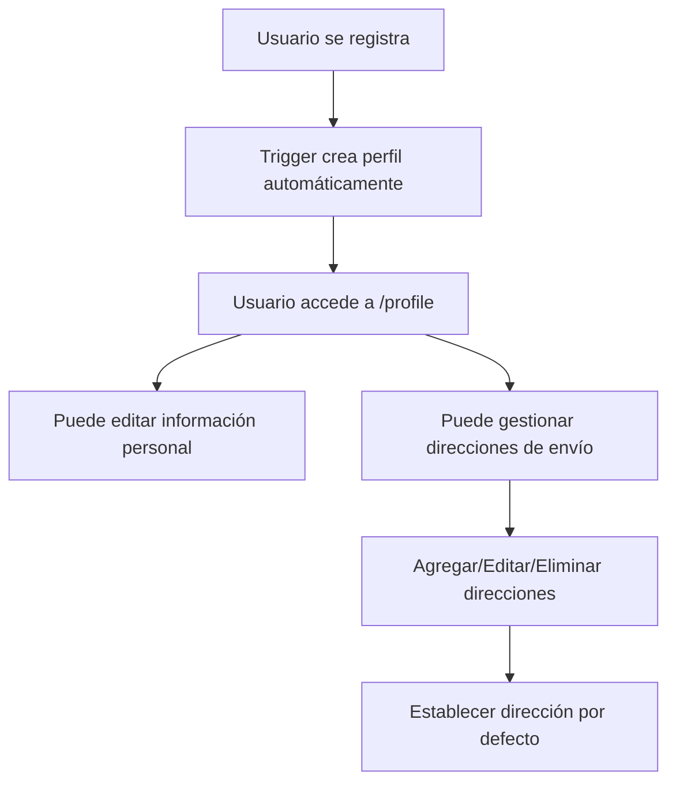

# Guía de Configuración de Supabase para MAC Shop

## 📋 Resumen de la Situación Actual

Tienes razón sobre las mejores prácticas de Supabase. La tabla `auth.users` debe usarse solo para autenticación, y necesitamos crear tablas separadas en el esquema `public` para datos adicionales del usuario.

## 🎯 Próximos Pasos Requeridos

### 1. **Configurar la Base de Datos en Supabase**

1. **Accede a tu Dashboard de Supabase**
   - Ve a [https://app.supabase.com](https://app.supabase.com)
   - Selecciona tu proyecto

2. **Ejecuta el Script SQL**
   - Ve a la sección "SQL Editor" en el sidebar
   - Copia y pega el contenido del archivo `supabase-setup.sql`
   - Ejecuta el script completo

3. **Verifica la Configuración**
   - Ve a "Database" → "Tables"
   - Deberías ver las tablas `profiles` y `shipping_addresses`
   - Verifica que RLS esté habilitado para ambas tablas

### 2. **Estructura de Tablas Creadas**

#### **Tabla `public.profiles`**
```sql
- id (UUID) → Referencias auth.users(id)
- email (TEXT)
- full_name (TEXT)
- phone (TEXT)
- date_of_birth (DATE)
- avatar_url (TEXT)
- created_at (TIMESTAMP)
- updated_at (TIMESTAMP)
```

#### **Tabla `public.shipping_addresses`**
```sql
- id (UUID) → Clave primaria
- user_id (UUID) → Referencias auth.users(id)
- title (TEXT) → "Casa", "Oficina", etc.
- first_name (TEXT)
- last_name (TEXT)
- company (TEXT) → Opcional
- address_line_1 (TEXT)
- address_line_2 (TEXT) → Opcional
- city (TEXT)
- state (TEXT)
- postal_code (TEXT)
- country (TEXT) → Por defecto "España"
- phone (TEXT) → Opcional
- is_default (BOOLEAN)
- created_at (TIMESTAMP)
- updated_at (TIMESTAMP)
```

### 3. **Funcionalidades Implementadas**

✅ **Row Level Security (RLS)**: Los usuarios solo pueden ver/editar sus propios datos  
✅ **Trigger Automático**: Crea perfil automáticamente al registrarse  
✅ **Gestión de Timestamps**: Actualiza `updated_at` automáticamente  
✅ **Dirección por Defecto**: Solo una dirección puede ser predeterminada  
✅ **Índices de Rendimiento**: Para consultas optimizadas  
✅ **Políticas de Seguridad**: Protección completa de datos

### 4. **Ajustes Necesarios en el Código**

#### **Actualizar las Interfaces TypeScript**
Las interfaces en `supabase.service.ts` ya están correctas y coinciden con la estructura de la base de datos.

#### **Probar la Funcionalidad**
1. Registra un nuevo usuario
2. Verifica que se cree automáticamente el perfil
3. Prueba agregar/editar direcciones de envío
4. Verifica que las políticas RLS funcionen correctamente

### 5. **Flujo de Trabajo Recomendado**



### 6. **Validación de Seguridad**

- **RLS habilitado**: ✅ Solo usuarios autenticados pueden acceder a sus datos
- **Políticas específicas**: ✅ Cada operación (SELECT, INSERT, UPDATE, DELETE) tiene su política
- **Cascade Delete**: ✅ Si se elimina un usuario, se eliminan sus datos relacionados
- **Validación de entrada**: ✅ Campos requeridos y tipos de datos validados

### 7. **Próximos Desarrollos**

Una vez configurada la base de datos, podremos:

1. **Agregar sección de pedidos** (`orders` table)
2. **Implementar historial de compras**
3. **Agregar favoritos/wishlist**
4. **Sistema de notificaciones**
5. **Integración con pasarelas de pago**

## 🚀 Instrucciones de Ejecución

1. **Ejecuta el script SQL** en tu Supabase Dashboard
2. **Verifica las tablas** creadas
3. **Prueba el registro** de un nuevo usuario
4. **Accede a `/profile`** para probar la funcionalidad

## 📝 Notas Importantes

- **No modifiques la tabla `auth.users`** directamente
- **Usa siempre las tablas `public.profiles` y `public.shipping_addresses`**
- **Las políticas RLS protegen automáticamente los datos**
- **El trigger crea perfiles automáticamente en el registro**

## 🔧 Troubleshooting

Si encuentras problemas:
1. Verifica que RLS esté habilitado
2. Comprueba que las políticas estén activas
3. Asegúrate de que el usuario esté autenticado
4. Revisa los logs en Supabase Dashboard

---

**¿Listo para configurar la base de datos?** Ejecuta el script `supabase-setup.sql` en tu Supabase Dashboard y luego podremos probar la funcionalidad completa del perfil de usuario. 